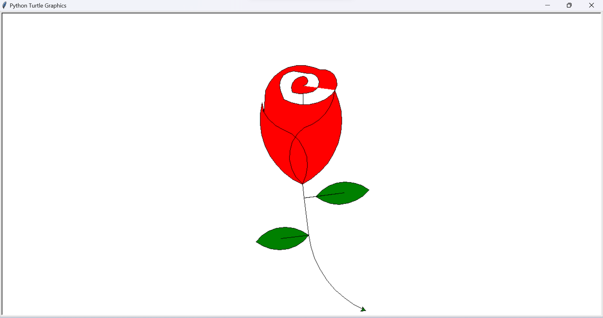

**##🌹 Python Turtle Rose Drawing**

This project is a simple yet elegant Python script that uses the built-in turtle graphics library to draw a beautiful red rose with green leaves.

---

## 🖼️ Final Output

Running the script will open a new window and display the animated drawing of the rose. The final image is a complete flower that fits neatly within the screen.

---

## 🧠 Technical Description

This script is written in Python and uses only the built-in turtle module—no external libraries required.

## How it works:

Initialization: The script starts by importing the turtle module.

Positioning: The turtle is moved to a suitable starting position to ensure the rose fits well on the canvas.

Drawing & Coloring: The rose and leaves are drawn using a series of turtle commands (circle, forward, left, right, etc.). The rose is filled with red and the leaves with green using fillcolor() and begin_fill()/end_fill().

Completion: The drawing window remains open with turtle.done() so the user can admire the artwork.

---

## 📂 Repository Structure
.
├── index.py       # Main Python script to draw the rose
└── README.md      # Project documentation

---

## 🚀 How to Run

1. Make sure Python 3.x is installed on your system.
2. Save the code as index.py.
3. Open a terminal or command prompt.
4. Navigate to the folder where the file is saved.
5. Run the script using: python index.py
6. A new window will pop up and draw the rose for you!

---

## ✍️ Author

- **Ritesh Raut**
- *Programmer Analyst, Cognizant*

🌹 Code in Bloom — Draw a Rose with Python Turtle! 🐢🎨

---

### 🌐 Connect with me:

---
